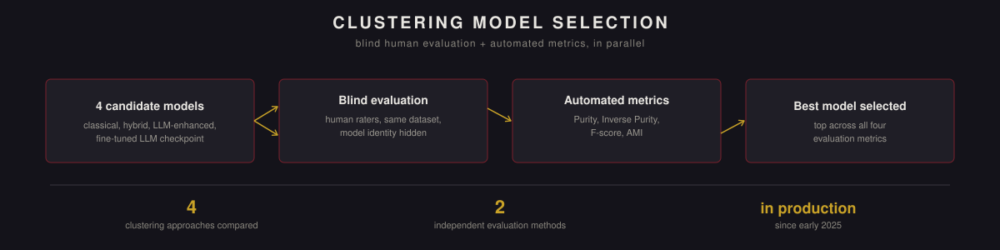

  

<a href="README.md">English version →</a>

# Многоуровневая кластеризация для классификации интентов чат-бота

> **О коде и границах проекта.** Этот репозиторий описывает методологию, ключевые решения и результаты; реализация является собственностью компании и не публикуется. Это была кросс-функциональная инициатива под единым продакт-оунером, реализованная совместно с командами NLP и разработки чат-бота. Здесь описана сторона data analytics — методология оценки, дизайн экспериментов и выбор модели, — которую вела автор. Дообученный LLM-чекпоинт, один из четырёх сравниваемых кандидатов, обучала команда ML-инженеров, а не автор.

Гибкая многоуровневая система кластеризации запросов к чат-боту, заменившая единый жёсткий подход к кластеризации на четыре кандидатных метода, оценённых параллельно — слепой оценкой людей и автоматическими метриками кластеризации, — чтобы выбрать лучшую модель на основе данных, а не интуиции.

## Кратко

| | |
|---|---|
| **Сравнено подходов** | 4 (классический TF-IDF, гибридный, LLM-усиленный, дообученный LLM-чекпоинт) |
| **Методы оценки** | слепая оценка людьми + автоматические метрики `sklearn` (Purity, Inverse Purity, F-score, AMI), независимо друг от друга |
| **Итог отбора** | одна модель заняла первое место по всем четырём автоматическим метрикам |
| **Масштаб** | применялось ко всему входящему потоку запросов чат-бота, требующих кластеризации, а не к фиксированной разовой выборке |
| **Статус** | интегрировано во внутреннюю платформу чат-бота компании; в проде с начала 2025 года |

## Проблема

Существующая система кластеризации имела три накладывающиеся проблемы: кластеры часто смешивали несвязанные интенты, читаемость терялась с ростом объёма данных, а сложные условные интенты — те, что зависят от нескольких сигналов для корректной классификации — фактически распределялись случайно.

## Подход

**Разработка метрик (совместно с командой NLP).** Прежде чем сравнивать какие-либо модели, команда определила, что именно значит «хорошая кластеризация», в трёх измеримых терминах: однородность (кластер должен представлять один интент, а не несколько), различимость (кластеры должны чётко отличаться друг от друга) и практическая применимость (кластер не должен требовать масштабной ручной чистки перед использованием). Это дало объективную основу для сравнения вместо субъективного «этот выглядит лучше».

**Четыре кандидатных подхода**, спроектированных для работы как с сырыми, так и с частично обработанными и неполными запросами:
- **Классический** — TF-IDF в сочетании с семантической близостью.
- **Гибридный** — теги, существующая разметка и частотные признаки.
- **LLM-усиленный** — слой LLM поверх результата кластеризации для дополнительной интерпретации.
- **Дообученный LLM-чекпоинт** — обучен командой ML-инженеров специально под эту задачу.

**Оценка, проведённая параллельно двумя способами.** Разметчики оценивали качество кластеризации на одном датасете, не зная, какая модель дала какой результат (слепая оценка), а метрики на основе `sklearn` (Purity, Inverse Purity, F-score, AMI) оценивали те же результаты автоматически. Оба метода были спроектированы так, чтобы проверять друг друга — модель, которая выглядела хорошо только по одному измерению, не заслужила бы доверия.

**Доразметка с помощью LLM.** После выбора модели добавлен проход доразметки кластеров через LLM, чтобы повысить интерпретируемость именно для сложных, условных интентов, с которыми старая система справлялась хуже всего.

## Результаты

- Выбранная модель превзошла три альтернативы по всем четырём автоматическим метрикам оценки, и слепая оценка людей указывала на тот же вывод.
- Точность классификации выросла именно на сложных, многоусловных интентах — ровно той категории, с которой старая система справлялась хуже всего.
- Подход достаточно гибок, чтобы работать с сырыми, частично обработанными или неполными запросами без отдельного пайплайна под каждый случай.
- Сокращён объём ручной чистки, ранее необходимой, чтобы сделать кластеры пригодными к использованию.

## Влияние на бизнес

- Более качественная кластеризация напрямую улучшила релевантность ответов чат-бота для пользователей.
- Снижена нагрузка на ручную проверку для команды интент-аналитики.
- Создана переиспользуемая методология оценки — слепая оценка плюс автоматические метрики кластеризации, — которую команда может применять и к будущим сравнениям моделей, не только к этому.

## Технологии

Python · scikit-learn · SQL · LLM-разметка · фреймворки A/B и слепого тестирования · BI-инструменты

---

Кросс-функциональный проект (аналитика, NLP, разработка) под общим продакт-оунерством. Описан здесь со стороны data analytics, которую вела автор — методология оценки и дизайн экспериментов; продовый код не публикуется.
