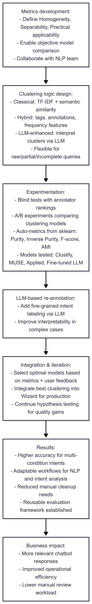

# Multi-Level Clustering for Chatbot Intent Classification

---

## 🇬🇧 English Version

**Timeline:** Q3 2024  
**Role:** Lead Intent Analysis Coordinator & NLP Collaboration Manager  
**Tech stack:** Python • SQL • Scikit-learn • LLM-based annotation • A/B testing frameworks • BI tools  

### Context
The old clustering system had significant limitations:  
- **Low accuracy for intent analysis** – many clusters contained mixed or irrelevant intents.  
- **Poor scalability** – cluster readability collapsed as data volume grew.  
- **No adaptability** – complex conditional intents were randomly assigned to clusters.  

### Goal
Develop and integrate a **flexible, multi-level clustering system** for chatbot queries to:  
- Improve **accuracy** of intent classification.  
- Enable **adaptation** for different types of tasks.  
- Support **scalable processing** as dataset size increases.  

### Approach

**1. Metrics Development**  
- Co-developed evaluation metrics with the NLP team:  
  - **Homogeneity** – all texts in a cluster share the same intent.  
  - **Separability** – clusters are clearly distinguishable.  
  - **Practical applicability** – clusters require minimal manual cleaning.  
- Used metrics to compare models objectively rather than relying on subjective “looks good” judgment.  

**2. Clustering Logic Design**  
- Designed multiple clustering approaches:  
  - **Classical** – TF-IDF + semantic similarity.  
  - **Hybrid** – tags, annotations, frequency features.  
  - **LLM-enhanced** – extra interpretation via Large Language Models.  
- Ensured flexibility: works with raw, partially processed, or incomplete queries.  

**3. Experimentation**  
- Organized **blind testing** and **A/B experiments**:  
  - Users ranked clustering quality for the same dataset across models.  
  - Automatically compared models using `sklearn` metrics (Purity, Inverse Purity, F-score, AMI).  
- Benchmarked multiple models: Clustify, MUSE, Applied, Fine-tuned LLM checkpoint.  

**4. LLM-based Re-annotation**  
- Added fine-grained intent labeling with LLMs, improving cluster interpretability in complex scenarios.  

**5. Integration & Iteration**  
- Selected optimal models based on combined metric scores + user ratings.  
- Integrated best-performing clustering into **Wizard** for production use.  
- Continued iteration on hypothesis testing for further quality improvements.  

### Results
- New clustering **increased classification accuracy** in difficult multi-condition intents.  
- Provided **adaptable workflows** for various NLP and intent-analysis tasks.  
- Enabled **automated intent review** with reduced manual cleanup needs.  
- Established **reusable A/B testing and evaluation framework** for clustering models.  

### Business Impact
- Improved **user experience** via more relevant chatbot responses.  
- Increased **operational efficiency** in intent analysis workflows.  
- Reduced manual review workload for the analytics team.  

### Key Skills Highlighted
- Metrics development for NLP evaluation.  
- Multi-team project coordination between analytics, NLP, and chatbot engineering.  
- Experimental design (A/B, blind testing).  
- Application of LLMs for annotation enhancement.

### Data Pipeline

---

## 🇷🇺 Русский вариант

**Таймлайн:** Q3 2024  
**Роль:** Координатор по интент-анализу и взаимодействию с NLP командой  
**Технологии:** Python • SQL • Scikit-learn • LLM-дорасметка • фреймворки для A/B тестов • BI инструменты  

### Контекст
Старая кластеризация имела критические недостатки:  
- **Низкая точность для интент-анализа** — кластеры часто содержали смешанные или нерелевантные интенты.  
- **Плохая масштабируемость** — с ростом данных терялась читаемость и структура.  
- **Отсутствие адаптивности** — сложные условные интенты попадали в случайные кластеры.  

### Цель
Разработать и внедрить **гибкую многоуровневую кластеризацию** запросов к чатботу для:  
- Повышения **точности** классификации интентов.  
- Возможности **адаптации** под разные типы задач.  
- Поддержки **масштабируемой обработки** при росте датасета.  

### Подход

**1. Разработка метрик**  
- Совместно с командой NLP определены ключевые метрики:  
  - **Однородность** — все тексты кластера относятся к одному намерению.  
  - **Различимость** — кластеры легко разделимы.  
  - **Практическая применимость** — кластеры не требуют ручной чистки.  
- Метрики позволили объективно сравнивать модели вместо субъективной оценки «на глаз».  

**2. Проектирование логики кластеризации**  
- Разработано несколько вариантов подхода:  
  - **Классический** — TF-IDF + семантическая близость.  
  - **Смешанный** — теги, разметка, частотные признаки.  
  - **LLM-дорасметка** — дополнительная интерпретация кластеров языковой моделью.  
- Гибкость: работа с «сырыми», частично обработанными или неполными формулировками.  

**3. Эксперименты**  
- Организованы **слепые тесты** и **A/B эксперименты**:  
  - Разметчики оценивали качество кластеризации на одном датасете в разных моделях.  
  - Автоматическое сравнение по метрикам из `sklearn` (Purity, Inversed Purity, F-score, AMI).  
- Тестировались Clustify, MUSE, Applied, дообученная LLM-модель.  

**4. Дорасметка с LLM**  
- Внедрена дорасметка интентов с использованием LLM, что улучшило интерпретируемость кластеров в сложных сценариях.  

**5. Интеграция и итерации**  
- По совокупности метрик и отзывов выбраны лучшие модели.  
- Внедрение кластеризации в **Wizard** для продакшн-использования.  
- Продолжаем тестировать гипотезы для дальнейшего повышения качества.  

### Результаты
- Повышена точность классификации в сложных интентах с условиями.  
- Обеспечена адаптивность под различные задачи NLP и интент-анализа.  
- Сокращено время ручной чистки данных.  
- Создана методология тестирования и оценки кластеризаций.  

### Бизнес-эффект
- Улучшено качество ответов чатбота за счёт более точной классификации запросов.  
- Оптимизирована работа команды интент-аналитиков.  
- Снижена нагрузка на ручную проверку кластеров.  

### Ключевые навыки
- Разработка метрик для оценки моделей NLP.  
- Координация между аналитиками, NLP и разработчиками чатбота.  
- Постановка и проведение A/B тестов и слепых проверок.  
- Применение LLM для повышения качества разметки.  

### Пайплайн

